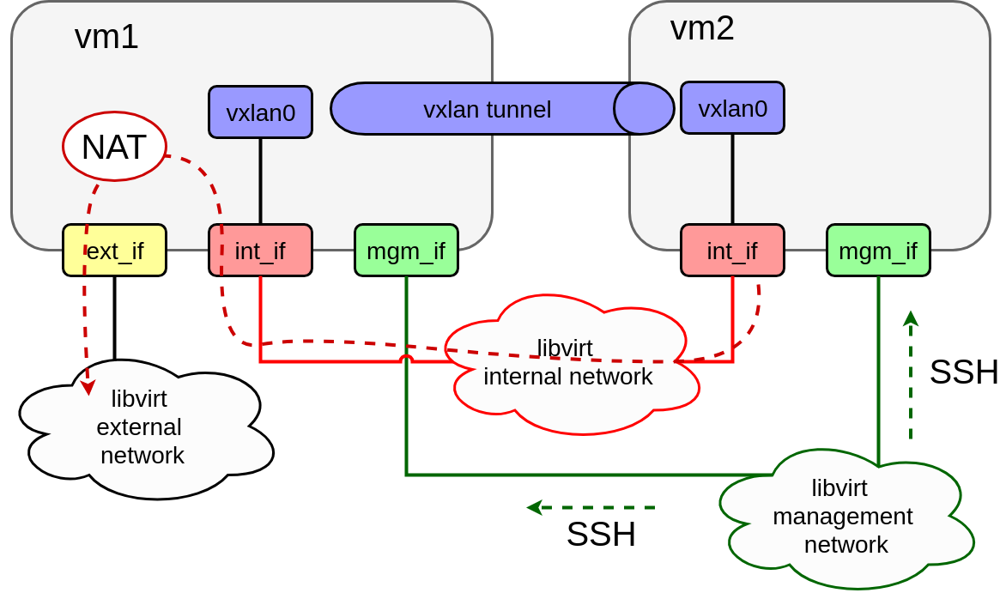

# Task 10.12.1 — Two-VM Infrastructure Deployment

## Overview

A bash script that automatically provisions a two-VM KVM infrastructure using **libvirt**, **virt-install**, and **cloud-init**. The environment consists of three isolated virtual networks and two virtual machines configured with static networking, IP forwarding, a VXLAN overlay tunnel, and Docker CE — all set up without manual intervention.

---

## Architecture

<p align="center">
  <br><br>
  <em>Figure 1 — Assignment Topology</em>
</p>

---

## Networks

Three libvirt networks are created from XML templates:

| Network | Type | DHCP | Notes |
|---|---|---|---|
| **external** | NAT | Yes | Single static entry reserved for vm1's MAC address |
| **internal** | Isolated | No | No IP addresses assigned; used for VM-to-VM traffic |
| **management** | Isolated | No | Host IP assigned for L3 connectivity to VMs; no DHCP |

---

## Virtual Machines

### vm1

Three network interfaces:

- **External** (`ens3`) — DHCP, connected to the external/NAT network; provides internet access for both VMs via IP masquerading
- **Internal** (`ens4`) — static IP; connected to the internal network
- **Management** (`ens5`) — static IP; connected to the management network

### vm2

Two network interfaces:

- **Internal** (`ens3`) — static IP; default gateway set to vm1's internal IP; DNS set to `8.8.8.8`
- **Management** (`ens4`) — static IP; connected to the management network

---

## cloud-init Configuration

Both VMs are configured on first boot via cloud-init:

- Hostname set (`vm1` / `vm2`)
- SSH access enabled using the public key specified in `config`
- Network interfaces configured (see per-VM details above)
- **vm1:** IP forwarding enabled; iptables NAT masquerade rules applied and persisted so that vm2's external traffic routes through vm1's external interface
- VXLAN tunnel (`vxlan0`) created between vm1 and vm2 using the internal network as the underlay
- **Docker CE** installed from the official repository (`https://download.docker.com/linux/ubuntu`) on both VMs

---

## Required Files

### Repository structure

The script generates all runtime artifacts. The final working directory must contain:

```
WORKDIR/
├── config                        # configurable parameters
├── config-drives/
│   ├── vm1-config/
│   │   ├── meta-data
│   │   └── user-data
│   └── vm2-config/
│       ├── meta-data
│       └── user-data
├── task10_12_1.sh                # entry point — this file is executed by the grader
└── networks/
    ├── external.xml
    ├── internal.xml
    └── management.xml
```

### `config` — parameters file

All tuneable parameters are centralised here. The script reads this file at startup.

```bash
# Libvirt networks
# external network parameters
EXTERNAL_NET_NAME=external
EXTERNAL_NET_TYPE=dhcp
EXTERNAL_NET=192.168.123
EXTERNAL_NET_IP=${EXTERNAL_NET}.0
EXTERNAL_NET_MASK=255.255.255.0
EXTERNAL_NET_HOST_IP=${EXTERNAL_NET}.1
VM1_EXTERNAL_IP=${EXTERNAL_NET}.101

# internal network parameters
INTERNAL_NET_NAME=internal
INTERNAL_NET=192.168.124
INTERNAL_NET_IP=${INTERNAL_NET}.0
INTERNAL_NET_MASK=255.255.255.0

# management network parameters
MANAGEMENT_NET_NAME=management
MANAGEMENT_NET=192.168.125
MANAGEMENT_NET_IP=${MANAGEMENT_NET}.0
MANAGEMENT_NET_MASK=255.255.255.0
MANAGEMENT_HOST_IP=${MANAGEMENT_NET}.1

# VMs global parameters
SSH_PUB_KEY=/home/jenkins/.ssh/id_rsa.pub
VM_TYPE=hvm
VM_DNS=8.8.8.8
# overlay
VXLAN_NET=10.255.0
VID=12345
VXLAN_IF=vxlan0

# VMs
VM1_NAME=vm1
VM1_NUM_CPU=1
VM1_MB_RAM=512
VM1_HDD=/var/lib/libvirt/images/vm1/vm1.qcow2
VM1_CONFIG_ISO=/var/lib/libvirt/images/vm1/config-vm1.iso
VM1_EXTERNAL_IF=ens3
VM1_INTERNAL_IF=ens4
VM1_MANAGEMENT_IF=ens5
VM1_INTERNAL_IP=${INTERNAL_NET}.101
VM1_MANAGEMENT_IP=${MANAGEMENT_NET}.101
VM1_VXLAN_IP=${VXLAN_NET}.101

VM2_NAME=vm2
VM2_NUM_CPU=1
VM2_MB_RAM=512
VM2_HDD=/var/lib/libvirt/images/vm2/vm2.qcow2
VM2_CONFIG_ISO=/var/lib/libvirt/images/vm2/config-vm2.iso
VM2_INTERNAL_IF=ens3
VM2_MANAGEMENT_IF=ens4
VM2_INTERNAL_IP=${INTERNAL_NET}.102
VM2_MANAGEMENT_IP=${MANAGEMENT_NET}.102
VM2_VXLAN_IP=${VXLAN_NET}.102
```

---

## Implementation Notes

1. Create libvirt networks using `virsh net-define` + `virsh net-start` with XML definitions.
2. Create VMs using `virt-install --import` against a pre-downloaded cloud image.
3. Generate a unique MAC address for vm1's external interface (required for the DHCP static lease):
   ```bash
   MAC=52:54:00:`(date; cat /proc/interrupts) | md5sum | sed -r 's/^(.{6}).*$/\1/; s/([0-9a-f]{2})/\1:/g; s/:$//;'`
   ```
4. Download the base image URL from the value defined in `config`.
5. Expand the disk after copying the base image:
   ```bash
   qemu-img resize <image>.qcow2 +3GB
   ```
6. Use the cloud-init `meta-data` file to set hostname, SSH key, and network interface configuration.
7. Build the cloud-init ISO with:
   ```bash
   mkisofs -o <output>.iso -V cidata -r -J <source-dir>
   ```

---

## Environment Setup Guide

The grader runs a freshly installed Ubuntu 16.04 VM with the following packages pre-installed:
`qemu-kvm`, `libvirt-bin`, `virtinst`, `bridge-utils`, `genisoimage`.

To replicate this environment locally before submission, use one of the options below.

### Option A — Vagrant (recommended — closest to the grader setup)

**Prerequisites:** [VirtualBox](https://www.virtualbox.org/) and [Vagrant](https://www.vagrantup.com/) installed.

Create a `Vagrantfile` in any working directory:

```ruby
Vagrant.configure("2") do |config|
  config.vm.box = "ubuntu/xenial64"
  config.vm.provider "virtualbox" do |vb|
    vb.memory = 4096
    vb.cpus   = 2
    vb.customize ["modifyvm", :id, "--nested-hw-virt", "on"]
  end
  config.vm.provision "shell", inline: <<-SHELL
    apt-get update
    apt-get install -y qemu-kvm libvirt-bin virtinst bridge-utils genisoimage git
    usermod -aG libvirtd vagrant
  SHELL
end
```

```bash
# Start and SSH into the VM
vagrant up
vagrant ssh

# Inside the VM
sudo -i
git clone https://github.com/<your-username>/task10_12_1 /root/task10_12_1
cd /root/task10_12_1
bash task10_12_1.sh
```

### Option B — Docker (limited — nested KVM not available on most hosts)

> **Note:** Docker cannot run `virsh` or `virt-install` on hosts without KVM passthrough. Use this only to validate script syntax and cloud-init file generation.

```bash
docker pull ubuntu:16.04
docker run -it --name infra-test ubuntu:16.04 /bin/bash
```

Inside the container:

```bash
apt-get update && apt-get install -y qemu-kvm libvirt-bin virtinst bridge-utils genisoimage git
git clone https://github.com/<your-username>/task10_12_1 /root/task10_12_1
cd /root/task10_12_1
bash task10_12_1.sh
```

---

## Verification Checklist

| Check | Command | Expected result |
|---|---|---|
| libvirt networks exist | `virsh net-list --all` | `external`, `internal`, `management` listed as active |
| External network type | `virsh net-dumpxml external` | `<forward mode='nat'>` present |
| vm1 static DHCP lease | `virsh net-dumpxml external` | `<host mac=... ip='...'/>` entry for vm1 |
| Both VMs running | `virsh list` | `vm1` and `vm2` in running state |
| VM1 interface count | SSH to vm1: `ip link show` | Three interfaces visible (external, internal, management) |
| VM2 interface count | SSH to vm2: `ip link show` | Two interfaces visible (internal, management) |
| vm2 internet access | SSH to vm2: `ping -c3 8.8.8.8` | Packets received (routing via vm1) |
| VXLAN tunnel — vm1 | SSH to vm1: `ip addr show vxlan0` | Interface up, VXLAN IP assigned |
| VXLAN tunnel — vm2 | SSH to vm2: `ip addr show vxlan0` | Interface up, VXLAN IP assigned |
| VXLAN connectivity | SSH to vm1: `ping -c3 <vm2-vxlan-ip>` | Packets received |
| Docker CE on vm1 | SSH to vm1: `docker --version` | Version string printed |
| Docker CE on vm2 | SSH to vm2: `docker --version` | Version string printed |

---

## Verification Procedure

### Environment

- **OS:** Ubuntu Xenial 16.04 Server (`xenial-server-cloudimg-amd64-disk1.img`)
- **User:** `root`
- **Pre-installed packages:** `qemu-kvm`, `libvirt-bin`, `virtinst`, `bridge-utils`, `genisoimage`
- **Network:** internet access available

### Execution Rules

- The repository must be named exactly **`task10_12_1`** on GitHub (e.g. `https://github.com/user/task10_12_1`). A different name results in automatic failure.
- `task10_12_1.sh` must be in the repository root. A different name or location results in automatic failure.
- The script is executed as `root` with no arguments.
- Any additional packages required by the script must be installed by the script itself.
- Practical assignments for LC10-12 must be submitted by **23:59 on 09/05/18**.

### What Is Verified

- Presence and correct type of all three libvirt networks
- Both VMs are running and connected to the correct networks
- SSH access to both VMs via the management network using login `ubuntu` and the public key from `config`
- Correct IP addresses on all interfaces
- Internet access from both VMs (vm2 routing through vm1)
- VXLAN tunnel connectivity between vm1 and vm2
- `docker-ce` package installed on both VMs
